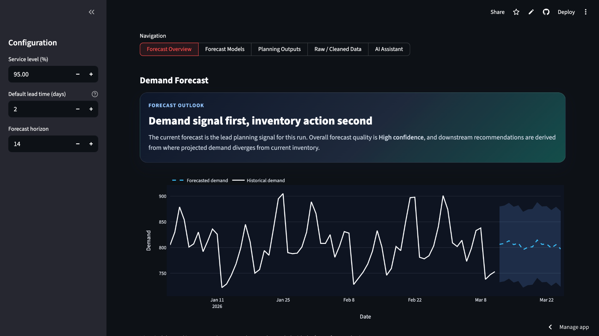
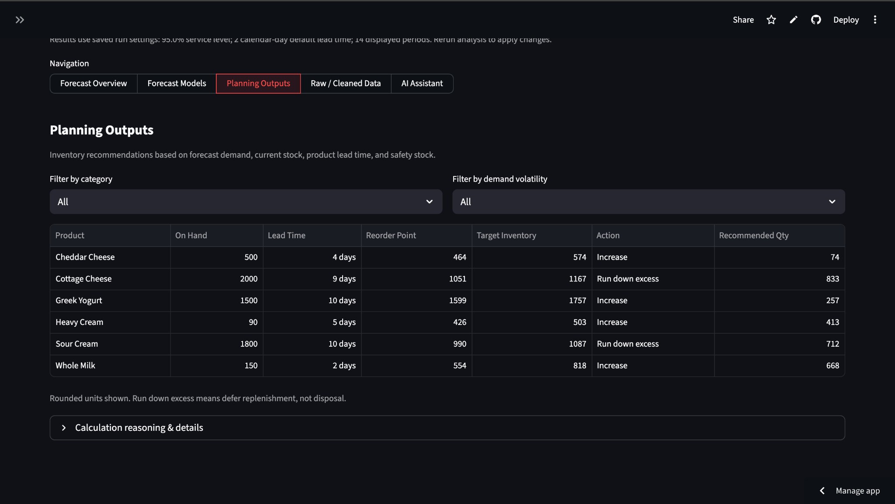
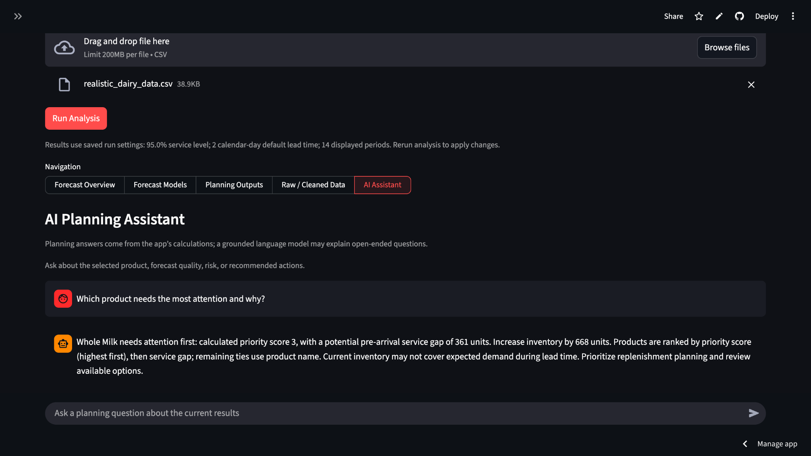

# Demand Forecasting & Inventory Planning

A deployed supply chain analytics application that cleans uploaded demand data,
forecasts demand by product, and evaluates and selects forecasting models using
holdout performance. It converts forecasts into inventory recommendations and
identifies potential pre-arrival service gaps to help planners prioritize
replenishment and manage excess stock. A grounded AI Planning Assistant helps
users explore the calculated results through factual answers and natural-language
explanations.

**Live Demo:** [supply-chain-demand-planner.streamlit.app](https://supply-chain-demand-planner.streamlit.app)

**Try the demo:** Open the live app, click **Download Demo Dataset**, upload the
downloaded CSV, and click **Run Analysis**. The included dataset is also available
here: [demo_dairy_demand.csv](data/demo_dairy_demand.csv).

The included dairy dataset is entirely synthetic and was created solely to demonstrate the application's forecasting and inventory-planning workflow. It does not represent actual company, customer, supplier, or operational data.

## How It Works

Upload demand data → Clean & standardize → Forecast product demand → Evaluate/select models → Calculate inventory requirements → Prioritize planning actions → Explore results with the AI Planning Assistant

## Key Features

- **Data preparation:** CSV upload, column detection, and standardized demand data.
- **Product-level forecasting:** model selection using holdout performance, with MAE and MAPE reporting.
- **Inventory planning:** product-specific lead times, safety stock, reorder points, and daily-review target inventory levels. The sidebar default lead time applies when a product-specific value is unavailable.
- **Planning actions:** increase, maintain, or run-down recommendations, with potential pre-arrival service gaps and calculated priorities.
- **Results exploration:** interactive Plotly charts, calculation details, and CSV exports.
- **Grounded planning assistant:** deterministic answers for factual planning questions; OpenAI GPT-5 nano via the Responses API for appropriate open-ended explanations, with optional local Ollama when no OpenAI key is configured.

**Forecasting and inventory calculations are deterministic Python calculations,
not generated by the LLM.** Model-generated explanations can still be inaccurate
and do not replace the calculated planning outputs.

## Technology

Python · Streamlit · pandas · NumPy · statsmodels · Plotly · Matplotlib · OpenAI Responses API · optional Ollama

Ollama is a separate local service, not a Python package dependency.

## Testing

The project currently has **85 automated tests** covering forecasting and inventory
pipeline behavior, assistant routing and grounding, and AI provider behavior.
External API calls are mocked in tests, so tests do not spend API credits.

With the virtual environment active:

```bash
python -m unittest discover -s tests -v
```

## Screenshots

### Forecast Overview

This view shows historical demand, product-level forecasts, and the forecast outlook.



### Planning Outputs

Forecasts are translated into inventory planning outputs, including inventory on hand, product-specific lead times, reorder points, target inventory levels, recommended actions, and quantities.



### AI Planning Assistant

The assistant answers planning questions using calculated results, with a grounded language-model fallback for appropriate open-ended questions.



## Run Locally

The dependency versions in `requirements.txt` match the tested Python 3.9 environment.
From the project directory on macOS or Linux:

```bash
python3 -m venv .venv
source .venv/bin/activate
python -m pip install -r requirements.txt
python -m streamlit run app.py
```

On Windows, activate the environment with `.venv\Scripts\Activate.ps1` in PowerShell.
Open the local URL printed by Streamlit (normally `http://localhost:8501`).
Upload a CSV, choose the planning settings, and click **Run Analysis**.

The included [data/sample_demand.csv](data/sample_demand.csv) is a small, basic
forecasting sample. It has no inventory snapshots, so inventory actions are
withheld. Use [data/demo_dairy_demand.csv](data/demo_dairy_demand.csv) for the full
synthetic forecasting and inventory-planning demo shown in the screenshots.
For your own inventory-planning data, provide demand history with `date`, `product`,
`demand`, and `on_hand_inventory`; include `lead_time_days` for product-specific
lead times. Explicit zero stock is different from missing stock.

Other local datasets and generated `output/` files are excluded from Git by
default. Review a dataset's contents and sharing rights before intentionally
adding it to a public repository. Running analysis recreates the output directory.

## Optional AI Explanations

Set `OPENAI_API_KEY` in Streamlit Community Cloud Secrets or the environment to
use OpenAI `gpt-5-nano` through the Responses API. Keep the actual key out of
source code and Git; `.streamlit/secrets.toml` is ignored. Environment settings
have precedence over Streamlit Secrets. Calculated planning context is sent to
the selected provider only for questions that need a language-model explanation.

Each such question makes at most one model request, with SDK retries disabled,
a 30-second timeout, and a 1,200-token output budget (including reasoning).
OpenAI failure returns calculated facts rather than making another provider call.
Deterministic questions do not contact either provider.

Without an OpenAI key, the app uses local Ollama when available. With Ollama
installed, start its local service and obtain the configured model:

```bash
ollama serve
```

In another terminal:

```bash
ollama pull llama3.2:3b
```

If the Ollama desktop application already runs the service, skip `ollama serve`.
The app connects to `http://127.0.0.1:11434`. Deterministic answers do not require
Ollama; when the explanation service is unavailable, the assistant can display
calculated planning facts instead.

## Planning Assumptions

Inventory position currently equals usable on-hand stock; outstanding purchase
orders and backorders are not modeled. Run-down means reducing or deferring
replenishment, not disposing of inventory. Priority is a calculated planning
order, not a measured stockout probability. A pre-arrival service gap indicates
that current inventory may not cover expected demand during lead time; it is not
a confirmed stockout or an exact stockout date. See
[inventory planning details](docs/inventory_planning.md) for formulas and calendar assumptions.
